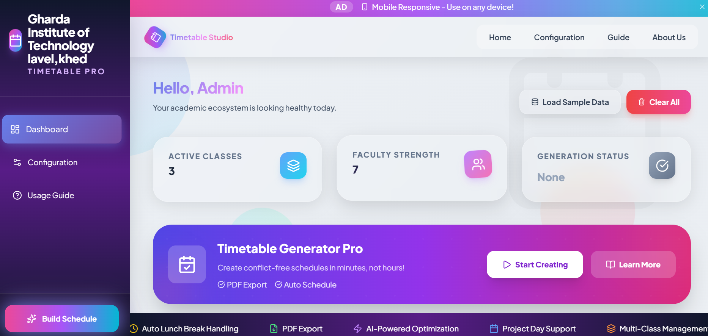
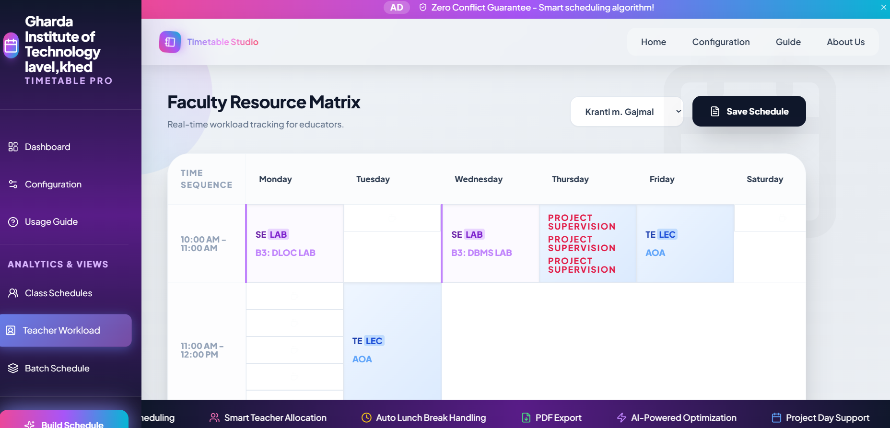
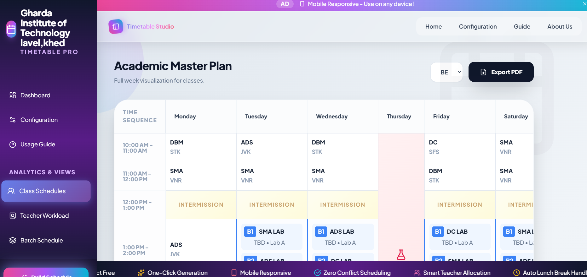

#  Automatic Timetable Generator


A web application that automatically generates conflict-free college timetables using a scheduling algorithm. The system reduces manual effort by generating optimized schedules while avoiding teacher and class conflicts.

## Problem Statement

Creating college timetables manually is a repetitive and error-prone process. Coordinating teachers, classes, laboratories, practical sessions, and lunch breaks often results in scheduling conflicts.

This project automates timetable generation by applying scheduling rules that ensure conflict-free and balanced timetables while significantly reducing manual work.
### 1. Backend (Python Flask)

**Windows (PowerShell):**
```powershell
python -m venv .venv
.\.venv\Scripts\Activate.ps1
pip install -r requirements.txt
python app.py
```

**Unix / macOS:**
```bash
python3 -m venv .venv
source .venv/bin/activate
pip install -r requirements.txt
python app.py
```

Backend API runs at **http://localhost:5000**

### 2. Frontend (Svelte + Vite)

```bash
cd frontend
npm install
npm run dev
```

Frontend dev server runs at **http://localhost:5173**

### 3. Build for Production

```bash
cd frontend
npm run build
```

Production build outputs to `frontend/dist/`. Flask serves it automatically.

## Testing

```bash
pytest
```

Runs backend unit tests validating timetable scheduling logic.

## Technology Stack

- **Backend**: Python Flask, scheduling algorithm, pytest
- **Frontend**: Svelte 4 + Vite 5 (modern reactive framework, no plain CSS)
- **Styling**: Scoped Svelte styles (CSS-in-JS)
- **Export**: jsPDF (PDF export feature)


##  Features

-  Automatic timetable generation
-  Teacher conflict detection
-  Practical and laboratory scheduling
-  Lunch break scheduling
-  User authentication
-  Class-wise timetable filtering
-  PDF export
-  Responsive Svelte frontend
-  REST API powered by Flask
-  Unit testing using Pytest
## 📷 Screenshots

 Dashboard

 

Faculty workload
|

 Timetable
  
## API Endpoints

- `GET /api/timetable` — fetch generated timetable
- `POST /api/bulk-add` — add classes, teachers, subjects
- `GET /health` — health check

## Project Structure

```
.
├── app.py                 # Flask backend
├── algorithm.py           # Scheduling algorithm
├── requirements.txt       # Python dependencies
├── frontend/              # Svelte + Vite frontend
│   ├── src/
│   │   ├── main.js       # Entry point
│   │   └── App.svelte    # Main component
│   ├── index.html        # HTML root
│   ├── package.json
│   └── vite.config.js
└── tests/                # Backend pytest tests
```
